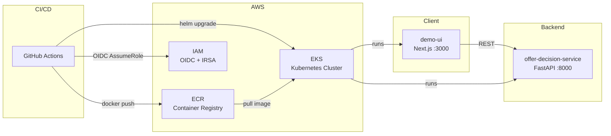

# Subscriber Offer Decisioning

Subscriber Offer Personalization Service — a working, demoable application slice
with a clean API contract, a minimal UI, and a basic test suite.

The offer decision is **policy-driven and deterministic**; AI may only improve
the wording of the explanation — never the business decision itself.

## Architecture



| Component | Tech | Port |
|-----------|------|------|
| Backend API | Python 3.12 / FastAPI / Uvicorn | 8000 |
| Frontend | Node 20 / Next.js 14 (React 18) | 3000 |
| Infrastructure | Terraform (ECR, IAM, EKS bindings) | — |
| Orchestration | Helm 3 on AWS EKS | — |
| Quality Gate | SonarCloud | — |

## Project Structure

```
services/offer-decision-service/   FastAPI backend
web/demo-ui/                       Next.js frontend
helm/offer-decision-service/       Helm chart
infra/terraform/                   Terraform modules (ECR, IAM, EKS bindings)
  modules/ecr/                     ECR repositories + lifecycle policies
  modules/iam/                     CI/CD OIDC role + policies
  modules/eks-bindings/            IRSA workload role (optional)
docs/                              Runbook, backlog
.github/workflows/                 CI/CD pipeline
```

## Prerequisites

- Docker & Docker Compose
- Python 3.12+ (for local backend development without Docker)
- Node 20+ (for local frontend development without Docker)
- Terraform >= 1.5 (for infrastructure changes)
- AWS CLI v2 (configured with appropriate credentials)

## Local Development Quickstart

```bash
# 1. Clone and enter the repo
git clone https://github.com/mbatchelor81/subscription-offer-app.git
cd subscription-offer-app

# 2. Copy env file and fill in values
cp .env.example .env
# Edit .env — at minimum set OPENAI_API_KEY for AI explanations

# 3. Start all services (backend + frontend)
make up

# 4. Verify
curl http://localhost:8000/healthz   # → {"status":"ok"}
open http://localhost:3000           # Frontend UI
```

### Useful Make Targets

| Command | Description |
|---------|-------------|
| `make up` | Build and start all services in the background |
| `make down` | Stop all services |
| `make test` | Run backend tests (pytest) |
| `make fmt` | Auto-format Python code (ruff) |
| `make lint` | Lint Python code (ruff) |

### Running Without Docker

**Backend:**
```bash
cd services/offer-decision-service
python -m venv .venv && source .venv/bin/activate
pip install -e ".[dev]"
uvicorn app.main:app --reload --host 0.0.0.0 --port 8000
```

**Frontend:**
```bash
cd web/demo-ui
npm install
npm run dev   # → http://localhost:3000
```

## CI/CD Pipeline

The GitHub Actions pipeline (`.github/workflows/ci.yml`) runs on every push
and pull request:

| Stage | Trigger | Description |
|-------|---------|-------------|
| **Lint & Test** | All pushes / PRs | `ruff check`, `pytest --cov`, upload coverage |
| **SonarCloud** | PRs + `main` only | Code quality gate (blocks on failure) |
| **Build & Push** | Push to `main` or `demo/*` | Multi-stage Docker build → ECR |
| **Deploy** | Push to `main` or `demo/*` | Helm upgrade to EKS |

### Required GitHub Secrets

| Secret | Purpose |
|--------|---------|
| `AWS_CICD_ROLE_ARN` | IAM role ARN for GitHub OIDC federation |
| `SONAR_TOKEN` | SonarCloud authentication |
| `OPENAI_API_KEY` | AI explanation enhancement |

## Deploying to EKS

### 1. Provision Infrastructure (one-time)

```bash
cd infra/terraform
terraform init
terraform plan    # Review changes
terraform apply   # Create/update ECR repos, IAM roles
```

### 2. Build & Push Images

Images are pushed automatically by CI on merge to `main`. To push manually:

```bash
# Authenticate to ECR
aws ecr get-login-password --region us-east-1 \
  | docker login --username AWS --password-stdin \
    599083837640.dkr.ecr.us-east-1.amazonaws.com

# Build and push backend
docker build -t 599083837640.dkr.ecr.us-east-1.amazonaws.com/offer-decision-service:latest \
  services/offer-decision-service/
docker push 599083837640.dkr.ecr.us-east-1.amazonaws.com/offer-decision-service:latest

# Build and push frontend
docker build -t 599083837640.dkr.ecr.us-east-1.amazonaws.com/demo-ui:latest \
  web/demo-ui/
docker push 599083837640.dkr.ecr.us-east-1.amazonaws.com/demo-ui:latest
```

### 3. Deploy with Helm

```bash
helm upgrade --install offer-decision-service helm/offer-decision-service \
  --namespace subscription-offer-app \
  --set image.tag=$(git rev-parse --short HEAD) \
  --wait
```

## Health Check

```bash
curl http://localhost:8000/healthz
# → {"status":"ok"}
```

## Further Reading

- [Runbook](docs/runbook.md) — rollback procedures, troubleshooting, key config values
- [Backlog](docs/backlog.md) — Phase 3+ planned features
- [Product Requirements](BASIC_PRD.md) — business context and requirements
